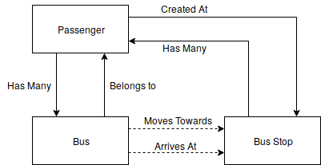

# bus-simulation

**Team Members**: Daphne Goh, Fong Yu Yang, Kevan Tan

Project was done for Simulation Modeling Analysis Module at SUTD. Objective was to create a framework that can compare different policies for how frequently buses should be dispatched. We focused on varying the time intervals the buses were released at for this project and performed statistical output analysis on the results to make comparisons between simulations. 

## General Architecture of Simulation

When we first started working on the simulation, we first decided what entities would exist within our simulation and the ones we decided upon are: Buses, Bus Stops and Passengers. We then decided on the process by which these entities would be created, updated and subsequently destroyed. 

Based on user defined data, and the decided upon structure of each entity (what kind of variables, properties), the simulation first populates the scene with these entities; such as drawing the stops, drawing the edges between then etc. The entities that are meant to move (eg. buses) are updated every cycle of the game to move them from one stop to another. Some functions that fall under the category of Update Functions are the loading/unloading of passenger, moving of buses from one stop to another (idle, moving, arrive states of the bus) and the destruction of the bus object when it has reached the terminal node. 

## Entity Relation Model

The relationship between the entities can be seen below. One key observation would be that the bus and bus stops are not directly related to each other. In other words, the bus entity does not contain or belong to the bus stop entity, although the bus entity does use the location of the bus stop to change its state (hence the dotted lines). Another thing to note is that the passenger entity can belong to either the bus or the bus stop. This is because the passenger entity is created (arrives) at the bus stop but when a bus reaches the stop, it is transferred onto the bus entity until the passenger reaches his/her intended destination. 

## Events Revolve Around Bus Entity
In our simulation, the bus is the key entity where all the events and other entities revolve around. In order to decide what events to trigger, we assigned three states to the bus object:

The bus first starts off in the idle state when it is created in the scene. At the next game cycle, it is set to travelling and begins to move towards its targetStop. The bus is first instantiated in the idle state with a list of parameters such as its origin, destination, capacity, passengers etc. This ensures that the subsequent operations that are performed on the bus objects will be without error.

In the Travelling state, the bus is made to move towards its next targetStop. Along the way, at every step, it is checking to see if it has arrived at the stop. When it does, its state gets set to Arrived. In this state, the distance that the bus travels at every time step has stochasticity built into it. We did so to emulate the different traffic conditions that a bus might meet along the road. 

When a bus is in the Arrived state, a few things happen. First, passengers whose target stop is the current stop the bus is at gets off. Secondly, as many new passengers as possible get on, up to the capacity of the bus. Lastly, the next targetStop is picked from the route that the bus has been assigned. 
